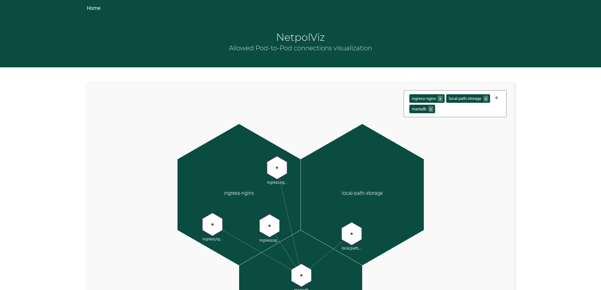

# NetpolViz

NetpolViz visualizes allowed pod2pod connections in clusters that are restricted by NetworkPolicies.



## Howto: Deploy

```bash
# add arivum Helm repo
helm repo add arivum "https://arivum.github.io/helm-charts"

# fetch the latest updates for all repos
helm repo update

# Create your my_values.yaml. Description on all properties can be found in ./build/helm/README.md
touch my_values.yaml

# deploy netpolviz
helm upgrade --install -v my_values.yaml netpolviz arivum/netpolviz
```